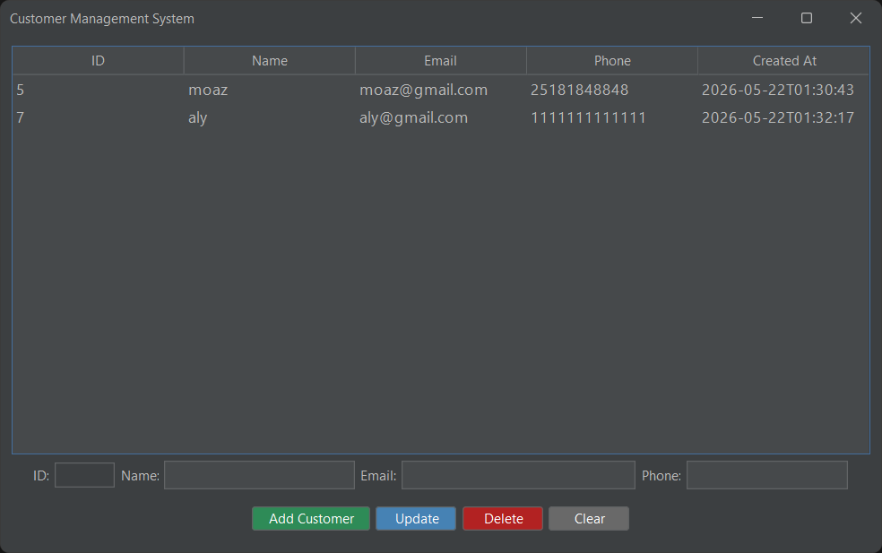
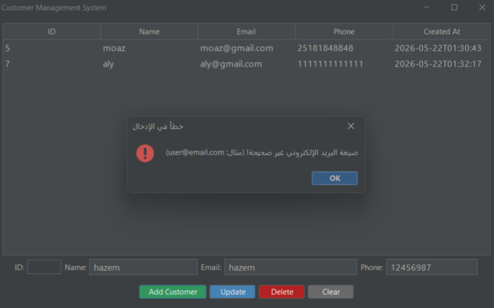
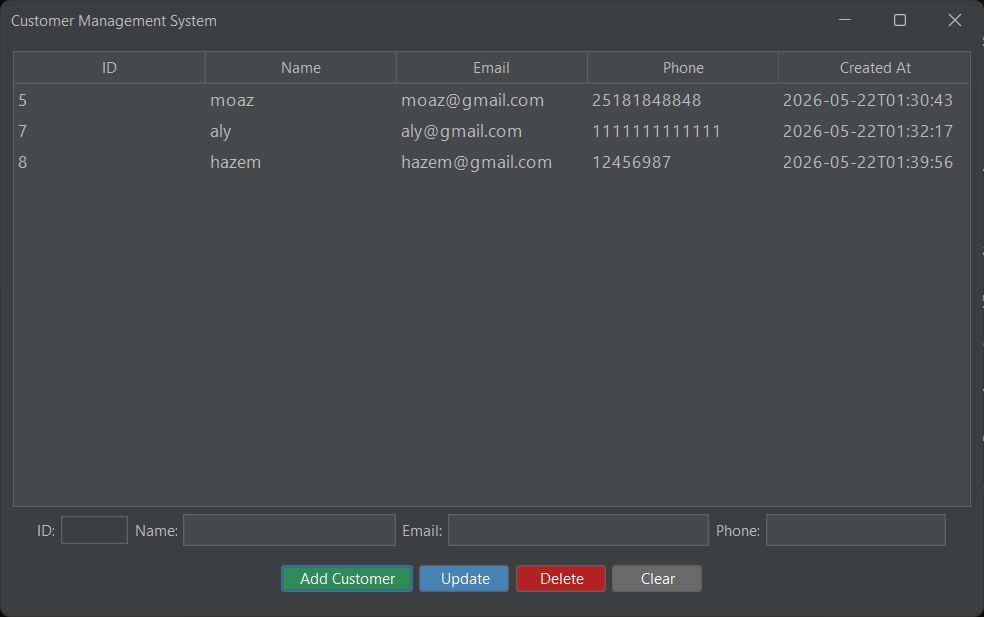

\# Customer Management Application


This is a Full-Stack Java application consisting of a Spring Boot REST API Backend and a modern Java Swing Desktop Client.


\## Project Structure

\- \*\*Backend\*\*: Built with Spring Boot, Spring Data JPA, and MySQL. Handles business logic and data access.

\- \*\*Desktop Client\*\*: Built with Java Swing (enhanced with FlatLaf UI Theme). It has NO direct database access and communicates purely via HTTP REST API.


\## Requirements

\- Java 21 or newer

\- Maven 3.x

\- MySQL Server


\## Setup and Run Instructions


\### 1. Database Setup

Execute the provided `schema.sql` file in your MySQL database to create the required schema and `customers` table.


\### 2. Running the Backend

Navigate to the backend project directory and run:

```bash

./mvnw clean spring-boot:run

## Application Screenshots

### 1. Main Interface & Loading Data


### 2. Input Validation Error Handling


### 3. Adding a New Customer Successfully


